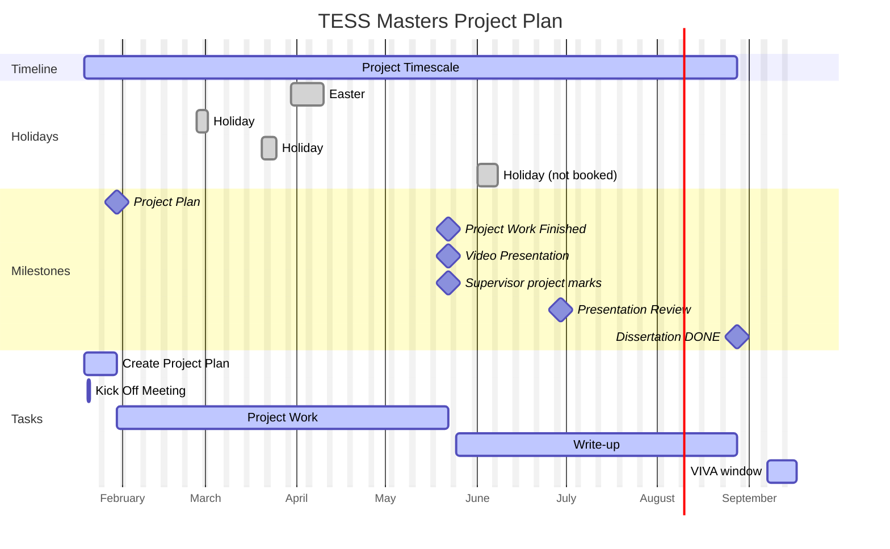

# Timeline for Masters Project

```mermaid

gantt
dateFormat  YYYY-MM-DD
excludes    weekends
axisFormat %B


title TESS Masters Project Plan

section Timeline
Project Timescale :active, tt1, 2026-01-19,2026-08-28

section Holidays
Easter :done, h1, 2026-03-30, 2026-04-10
Holiday :done ,h2, 2026-02-26, 2026-03-02
Holiday :done, h3, 2026-03-20,2026-03-25
Holiday (not booked) :done, 2026-06-01, 2026-06-08

section Milestones
Project Plan :milestone, m1, 2026-01-30, 0d
Project Work Finished :milestone, m2, 2026-05-22, 0d
Video Presentation :milestone, m2, 2026-05-22, 0d
Supervisor project marks :milestone, m3, 2026-05-22, 0d

Presentation Review :milestone, m4, 2026-06-29, 0d
Dissertation DONE :milestone, m5, 2026-08-28, 0d


section Tasks

Create Project Plan :active, t1, 2026-01-19, 2026-01-30
Kick Off Meeting :active, t2, 2026-01-20, 1d
Project Work :active, t3, 2026-01-30, 2026-05-22
Write-up :active, t4, 2026-05-25, 2026-08-28
VIVA window :active, t5, 2026-09-07, 2026-09-17

```